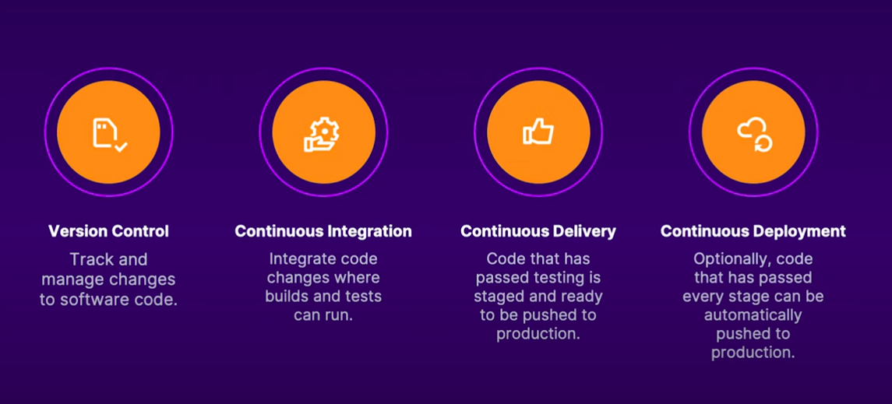

# Azure Resume Project: CI/CD Documentation

Welcome to the CI/CD documentation for the Azure Resume Project. This documentation provides an overview of the CI/CD pipelines used to deploy the Azure Functions and front-end web application to Azure using GitHub Actions.

## Table of Contents

- [Introduction to CI/CD](#introduction-to-cicd)
- [Authenticating with Azure](#authenticating-with-azure)
  - [Creating a Managed Identity](#creating-a-managed-identity)
  - [Configuring a Federated Identity Credential](#configuring-a-federated-identity-credential)
- [Creating the Frontend Workflow](#creating-the-frontend-workflow)
  - [Workflow Overview](#workflow-overview)
  - [Workflow Steps](#workflow-steps)
- [Creating the Backend Workflow](#creating-the-backend-workflow)
  - [Step-by-step breakdown of the workflow](#step-by-step-breakdown-of-the-workflow)
- [Conclusion](#conclusion)

## Introduction to CI/CD

Continuous Integration and Continuous Deployment (CI/CD) are essential practices in modern software development. They automate the integration of code changes and the deployment of the application to the production environment. CI/CD pipelines automate the build, test, and deployment processes, ensuring the application is always in a deployable state.



CI/CD pipelines are crucial for modern software development practices. They reduce the risk of human error, improve the speed of delivery, and increase the overall efficiency of the development process.

In this project, we'll use GitHub Actions to build a CI/CD pipeline that automates the deployment of the Azure Functions and front-end web application to Azure.

## Authenticating with Azure

To deploy the Azure Functions and front-end web application to Azure using GitHub Actions, we need to authenticate with Azure. We'll use an OpenID Connect (OIDC) token, a JSON Web Token (JWT) that can authenticate with Azure and access Azure resources. The OIDC token is generated using a federated identity credential associated with a managed identity in Azure.

### Creating a Managed Identity

A managed identity is an identity in Microsoft Entra ID (formerly Azure Active Directory). It's automatically managed by Azure and provides a Microsoft Entra ID identity for the Azure resources. Follow these steps to create a managed identity:

1. Navigate to the Azure portal.
2. Search for "Managed Identities" in the search bar.
3. Click on "Managed Identities" in the search results.
4. Click on "Add" to create a new managed identity.
5. Select a subscription, resource group, and name for the managed identity.
6. Click on "Review + create" to create the managed identity.
7. Once created, navigate to the "Identity" blade of the managed identity.

Assign a role to the managed identity to access the Azure resources required for the deployment. For example, assign the "Contributor" or "Owner" role to the managed identity at the subscription level to deploy resources to Azure.

### Configuring a Federated Identity Credential

A federated identity credential is a type of identity that is trusted across multiple IT systems or organizations. Follow these steps to configure a federated identity credential for the managed identity:

1. Navigate to the user-assigned managed identity created in the Azure portal.
2. Under "Settings", click on "Federated credentials".
3. Click on "Add federated credential" to add a new federated credential.
4. In the "Federated credential scenario" dropdown, select "GitHub Actions deploying azure resources".
5. Enter your GitHub organization name in the "Organization name" field.
6. Enter your GitHub repository name in the "Repository name" field.
7. For the "Entity type", select Environment, Branch, pull request, or tag and specify the value. The values must exactly match the configuration in the GitHub Actions workflow file. For example:

    - Branch: for workflow triggered by a push to the main branch.

        ```yml
        on:
          push:
            branches:
              - main
          pull_request:
            branches:
              - main
        ```

        select "Branch" as the entity type and specify "main" as the value.

    - Pull request: for workflow triggered by a pull request.

        ```yml
        on:
          pull_request:
            branches:
              - main
        ```

        select "Pull request" as the entity type and specify "main" as the value.

    - Tag: for workflow triggered by a tag.

        ```yml
        on:
          push:
            tags:
              - v*
        ```

        select "Tag" as the entity type and specify "v*" as the value.

    - Environment: for workflow triggered by a specific environment.

        ```yml
        on:
          push:
            branches:
              - main
        jobs:
          deploy:
            runs-on: ubuntu-latest
            environment: production
        ```

        select "Environment" as the entity type and specify "production" as the value.

8. Add a name for the federated credential.
9. The Issuer, Audiences, and Subject identifier fields will be auto-populated based on the values you enter.
10. Click "Add" to create the federated credential.

Use the following values from your Microsoft Entra managed identity to configure the GitHub Actions workflow:

- `AZURE_TENANT_ID`: The Azure AD tenant ID of your Azure subscription.
- `AZURE_CLIENT_ID`: The client ID of the managed identity.
- `AZURE_SUBSCRIPTION_ID`: The subscription ID of your Azure subscription.

Finally, use the Azure Login GitHub Action to authenticate with Azure using the OIDC token. This action allows you to authenticate with Azure and access Azure resources in your GitHub Actions workflow.

**Note**: In the Github workflow, set `permissions:` with `id-token: write` at the workflow level or job level, depending on whether the OIDC token is required for the entire workflow or a specific job.

## Creating the Frontend Workflow

This workflow is responsible for deploying the frontend of the application to Azure Blob Storage and purging the CDN endpoint whenever there are changes pushed to the `main` branch in the `frontend/` directory. Purging the CDN endpoint ensures that the latest version of the frontend files are served to users.

### Workflow Overview

The workflow is named `deploy-frontend` and is triggered on a `push` event to the `main` branch, specifically when changes are made within the `frontend/` directory.

The workflow has defined permissions to write ID tokens and read contents, which are necessary for the Azure login and operations performed in this workflow.

The workflow consists of a single job named `build` that runs on the latest Ubuntu runner. This job includes several steps that checkout the code, login to Azure, upload the frontend files to Azure Blob Storage, purge the CDN endpoint, and finally logout from Azure.

### Workflow Steps

1. Checkout: The first step, `Checkout`, uses the `actions/checkout@v4` action to checkout the code from the current repository. This step is necessary to access the frontend files in the repository.

2. Azure Login: The `Azure Login` step uses the `Azure/login@v2.1.0` action to authenticate with Azure. It uses the `client-id`, `tenant-id`, and `subscription-id` stored in the repository's secrets to authenticate.

3. **Edit file**: The `Edit file` step uses the `sed` command to replace the `hamburger` placeholder in the `frontend/main.js` file with the secret value that is stored in the repository's secrets `API_KEY`. This step is necessary to replace the placeholder with the actual value before deploying the frontend files. This is done to ensure that sensitive information is not exposed in the frontend code.

4. Upload to Blob Storage: The `Upload to blob storage` step uses the `azure/CLI@v1` action to run Azure CLI commands. The inline script uploads the frontend files to Azure Blob Storage using the `az storage blob upload-batch` command. The `--account-name` is set to `azureresumestaticwebhost`, the `--auth-mode` is set to `key`, the destination directory `-d` is set to `$web` (the root directory for static websites in Azure Blob Storage), and the source directory `-s` is set to `frontend/`. The `--overwrite` flag is used to overwrite any existing blobs with the same name.

5. Purge CDN Endpoint: The `Purge CDN endpoint` step also uses the `azure/CLI@v1` action to run Azure CLI commands. The inline script purges the CDN endpoint using the `az cdn endpoint purge` command. The `--content-paths` is set to `"/*"` to purge all paths, the `--profile-name` and `--name` are set to `"qurtanaazureresume"`, and the `--resource-group` is set to `"azure-resume-rg"`. Purging the CDN endpoint ensures that the latest version of the frontend files are served.

6. Logout: The final step, `logout`, runs the `az logout` command to logout from Azure. The `if: always()` condition ensures that this step is always run, regardless of the success or failure of previous steps. This is important for security reasons, to ensure that the GitHub Actions runner is not left authenticated with Azure after the workflow run.

## Creating the Backend Workflow

This GitHub Actions workflow is named `deploy-backend`. It's triggered on a `push` event to the `main` branch, specifically when changes are made in the `backend` directory.

### Step-by-step breakdown of the workflow

1. Environment Variables: The workflow sets several environment variables, including the name of the Azure Function App, the path to the Function App project, and the .NET version to use.

2. Jobs: The workflow defines a single job, build-and-deploy, which runs on the latest Windows runner.

3. Steps:

    - Checkout GitHub Action: This step checks out your repository so your workflow can access its contents.

    - Azure Login: This step logs into Azure using the Azure Login Action. It uses secrets to securely handle the client ID, tenant ID, and subscription ID.

    - Setup DotNet Environment: This step sets up a .NET environment using the specified .NET version.

    - Resolve Project Dependencies Using Dotnet: This step navigates to the Azure Function App project directory and builds the project using dotnet build.

    - Run unit tests: This step navigates to the tests directory and runs the unit tests using dotnet test.

    - Run Azure Functions Action: This step deploys the Azure Function App using the Azure Functions Action. It uses the name of the Azure Function App and the path to the built project.

This workflow is designed to build and deploy a .NET-based Azure Function App. It ensures that the app is built and tested before it's deployed to Azure.

## Conclusion

CI/CD pipelines are essential for automating the deployment process and ensuring that your application is always in a deployable state. By using GitHub Actions, you can create powerful workflows that build, test, and deploy your application to Azure. These workflows can be customized to fit your specific requirements and can help streamline your development process.
