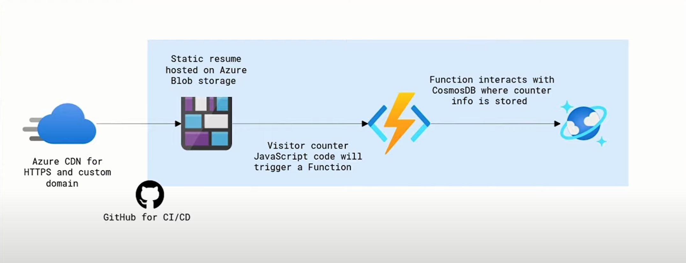

# Azure Resume Project

## Table of Contents

- [Overview](#overview)
- [Architecture](#architecture)
- [Prerequisites](#prerequisites)
- [Deployment](#deployment)
  - [Step 1: Building the front-end](#step-1-building-the-front-end)
  - [Step 2: Building the Azure Functions and Cosmos DB](#step-2-building-the-azure-functions-and-cosmos-db)
  - [Step 3: Deploying the Azure Functions and Front-end to Azure](#step-3-deploying-the-azure-functions-and-front-end-to-azure)
  - [Step 4: Configuring Azure Front Door and CDN](#step-4-configuring-azure-front-door-and-cdn)
  - [Step 5: Unit Testing](#step-5-unit-testing)
  - [Step 6: Building the CI/CD Pipeline](#step-6-building-the-pipeline)
- [References](#references)
  - [General](#general)
  - [Frontend](#frontend)
  - [Backend](#backend)
  - [CI/CD](#pipeline)
  - [Testing](#testing)
  - [Git](#git)
  - [Terraform](#terraform)
  - [Azure Front Door and CDN](#azure-front-door-and-cdn)
- [Contributions](#contributions)
- [Author](#author)
- [Conclusion](#conclusion)

## Overview

Welcome to the Azure Resume Project, a digital platform that encapsulates my professional journey. This project, part of my learning path with A Cloud Guru (ACG), is a testament to my skills and experiences in the tech industry.

The resume is organized into several sections, each highlighting a different facet of my professional profile:

- **About**: A brief introduction about me and my professional journey.
- **Experience**: A detailed overview of my work history and roles.
- **Education**: Information about my academic background and qualifications.
- **Skills**: A display of my technical and soft skills.
- **Projects**: Links to projects I've completed or contributed to, demonstrating my practical skills.
- **Contact**: Details on how to reach me for professional inquiries.

The web application, hosted on Microsoft Azure, demonstrates my proficiency in cloud services and deployment. Visit my Azure-hosted resume [here](https://resume.qurtana.com.ng/).

The web application resides in a storage account and is served as a static website. It's built using HTML, CSS, and JavaScript. JavaScript is used to implement a visitor counter stored in a Cosmos DB database. The visitor counter is implemented using Azure Functions, triggered by the web application. Azure Front Door and CDN are used for features like custom domain, SSL, and caching. GitHub Actions automate the deployment process for CI/CD.

## Architecture

## Prerequisites

To get started, you'll need:

1. **Azure Account**: An active Azure account to deploy the web application and Azure Functions. Create a free one [here](https://azure.microsoft.com/en-us/free/).
2. **.NET Core SDK**: Install the .NET Core SDK to build and run the Azure Functions locally. Download the SDK [here](https://dotnet.microsoft.com/download).
3. **Azure Functions Core Tools**: Install the Azure Functions Core Tools extension on VScode to run the Azure Functions locally.
4. **Azure CLI**: Install the Azure CLI to deploy the Azure Functions to Azure. Download the CLI [here](https://docs.microsoft.com/en-us/cli/azure/install-azure-cli).
5. **Visual Studio Code**: A code editor to write and edit the code. Download Visual Studio Code [here](https://code.visualstudio.com/).
6. **GitHub Account**: A GitHub account to store the source code and automate the deployment process using GitHub Actions. Create an account [here](https://github.com/).
7. **Terraform**: Install Terraform to automate the infrastructure deployment. Download Terraform [here](https://www.terraform.io/downloads.html).
8. **C# Extension**: Install the C# extension on VScode to write and debug the Azure Functions code.

## Deployment

Follow these steps to deploy the project:

### Step 1: Building the front-end

Refer to the front-end documentation [here](./frontend/README.md)

### Step 2: Building the Azure Functions and Cosmos DB

Refer to the Azure Functions documentation [here](./backend/api/README.md)

### Step 3: Deploying the Azure Functions and Front-end to Azure

Refer to the GitHub Actions documentation [here](./backend/api/README.md)

### Step 4: Configuring Azure Front Door and CDN

Refer to the Azure Front Door and CDN documentation [here](./backend/api/README.md)

### Step 5: Unit Testing

Refer to the unit testing documentation [here](./backend/tests/README.md)

### Step 6: Building the Pipeline

Refer to the GitHub Actions documentation [here](./.github/workflows/README.md)

## References

The following resources were used to build the project:

### General

- [Video guide by A Cloud Guru by Gwyn](https://youtu.be/ieYrBWmkfno?si=Aa7pd0wNr1gLKrMz)

### Frontend

- [How to make an API call with JavaScript and in a simple way how to use it to make an API call](https://www.digitalocean.com/community/tutorials/how-to-use-the-javascript-fetch-api-to-get-data)
- [Azure storage explorer is a handy tool to use when working with Storage Accounts](https://azure.microsoft.com/en-us/products/storage/storage-explorer/)
- [How to deploy to blog storage](https://learn.microsoft.com/en-us/azure/storage/blobs/storage-blob-static-website-host)

### Backend

- [HTTP triggered Azure Functions](https://learn.microsoft.com/en-us/azure/azure-functions/functions-bindings-http-webhook-trigger?tabs=python-v2%2Cisolated-process%2Cnodejs-v4%2Cfunctionsv2&pivots=programming-language-csharp)
- [Prerequisites for developing functions with visual code locally](https://learn.microsoft.com/en-us/azure/azure-functions/create-first-function-vs-code-csharp)
- [Create a Cosmos DB account via the portal](https://learn.microsoft.com/en-us/azure/cosmos-db/nosql/quickstart-portal)
- [Create an HTTP triggered Azure Function in Visual Studio Code](https://learn.microsoft.com/en-us/azure/azure-functions/functions-develop-vs-code?tabs=node-v4%2Cpython-v2%2Cisolated-process&pivots=programming-language-csharp)
- [Azure Functions Cosmos DB bindings](https://learn.microsoft.com/en-us/azure/azure-functions/functions-bindings-cosmosdb-v2?tabs=isolated-process%2Cextensionv4&pivots=programming-language-csharp)
- [Retrieve a Cosmos DB item with Functions binding](https://learn.microsoft.com/en-us/azure/azure-functions/functions-bindings-cosmosdb-v2-input?tabs=python-v2%2Cisolated-process%2Cnodejs-v4%2Cextensionv4&pivots=programming-language-csharp)
- [You'll have to enable CORS with Azure Functions locally and once it's deployed to Azure for you website to be able to call it](https://github.com/Azure/azure-functions-host/issues/1012)

### Pipeline

- [How to deploy a blob storage static site with GitHub actions](https://learn.microsoft.com/en-us/azure/storage/blobs/storage-blobs-static-site-github-actions?tabs=userlevel)
- [How to deploy an Azure Function to Azure with GitHub Actions](https://learn.microsoft.com/en-us/azure/azure-functions/functions-how-to-github-actions?tabs=windows%2Cdotnet&pivots=method-manual)
- [Implement .NET testing in GitHub Actions](https://docs.github.com/en/actions/automating-builds-and-tests/building-and-testing-net)

### Testing

- [The importance of testing](https://dev.to/flippedcoding/its-important-to-test-your-code-3lid)
- [Getting Started with xUnit.net](https://xunit.net/docs/getting-started/netcore/cmdline)
- [How to setup xUnit with Azure Functions](https://www.madebygps.com/how-to-use-xunit-with-azure-functions/)
- [Testing Azure Functions](https://learn.microsoft.com/en-us/azure/azure-functions/supported-languages?tabs=isolated-process%2Cv4&pivots=programming-language-csharp)

### Git

- [Git remove commits from branch after push: reset, revert, or rebase](https://www.abrahamberg.com/blog/git-remove-commits-from-branch-after-push-reset-revert-or-rebase/#:~:text=To%20remove%20specific%20commits%20from,record%20of%20the%20undo%20action.)

### Terraform

- [Cosmos DB Terraform Provider](https://registry.terraform.io/providers/hashicorp/azurerm/latest/docs/resources/cosmosdb_account)

### Azure Front Door and CDN

- [Azure Front Door and CDN](https://learn.microsoft.com/en-us/azure/frontdoor/)

## Contributions

Contributions are welcome! Feel free to submit a pull request or open an issue if you have any suggestions or improvements to the project.

## Author

**Hamed A. A.** - [LinkedIn](https://www.linkedin.com/in/qurtana/)

## Conclusion

The Azure Resume Project is a typical example of a three-tier architecture, with the front-end, back-end, and database layers. The project demonstrates my proficiency in cloud services, web development, and CI/CD practices. I hope you find the project insightful and informative. Feel free to reach out to me for any inquiries or collaborations.

Thank you for visiting my Azure-hosted resume!
