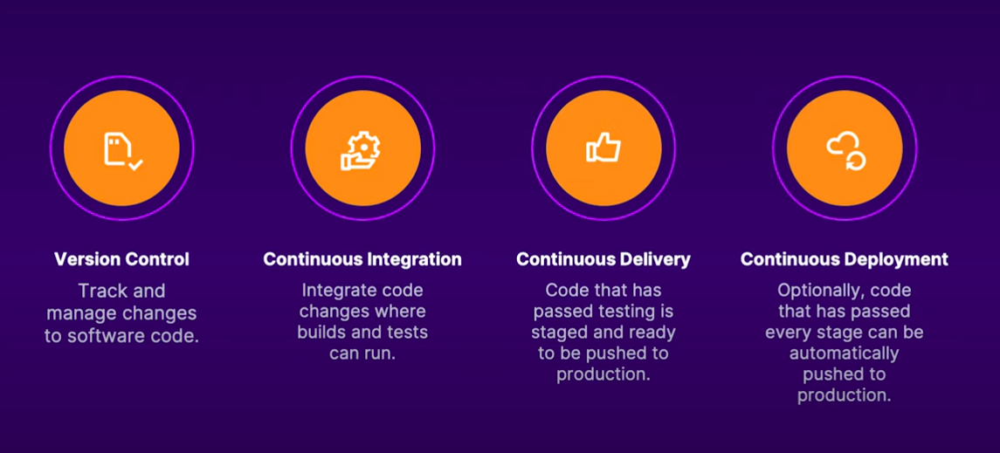

# Azure Resume Project

## Overview

Welcome to the Azure Resume Project, a digital platform that encapsulates my professional journey. This project, part of my learning path with A Cloud Guru (ACG), is a testament to my skills and experiences in the tech industry.

The resume is organized into several sections, each highlighting a different facet of my professional profile:

- **About**: A brief introduction about me and my professional journey.
- **Experience**: A detailed overview of my work history and roles.
- **Education**: Information about my academic background and qualifications.
- **Skills**: A display of my technical and soft skills.
- **Projects**: Links to projects I've completed or contributed to, demonstrating my practical skills.
- **Contact**: Details on how to reach me for professional inquiries.

The web application, hosted on Microsoft Azure, demonstrates my proficiency in cloud services and deployment. Visit my Azure-hosted resume [here](https://resume.qurtana.com.ng/).

The web application resides in a storage account and is served as a static website. It's built using HTML, CSS, and JavaScript. JavaScript is used to implement a visitor counter stored in a Cosmos DB database. The visitor counter is implemented using Azure Functions, triggered by the web application. Azure Front Door and CDN are used for features like custom domain, SSL, and caching. GitHub Actions automate the deployment process for CI/CD.

## Architecture

(Add a diagram or description of the architecture here)

## Prerequisites

To get started, you'll need:

1. **Azure Account**: An active Azure account to deploy the web application and Azure Functions. Create a free one [here](https://azure.microsoft.com/en-us/free/).
2. **.NET Core SDK**: Install the .NET Core SDK to build and run the Azure Functions locally. Download the SDK [here](https://dotnet.microsoft.com/download).
3. **Azure Functions Core Tools**: Install the Azure Functions Core Tools extension on VScode to run the Azure Functions locally.
4. **Azure CLI**: Install the Azure CLI to deploy the Azure Functions to Azure. Download the CLI [here](https://docs.microsoft.com/en-us/cli/azure/install-azure-cli).
5. **Visual Studio Code**: A code editor to write and edit the code. Download Visual Studio Code [here](https://code.visualstudio.com/).
6. **GitHub Account**: A GitHub account to store the source code and automate the deployment process using GitHub Actions. Create an account [here](https://github.com/).
7. **Terraform**: Install Terraform to automate the infrastructure deployment. Download Terraform [here](https://www.terraform.io/downloads.html).
8. **C# Extension**: Install the C# extension on VScode to write and debug the Azure Functions code.

## Deployment

Follow these steps to deploy the project:

### Step 1: Building the front-end

Refer to the front-end documentation [here](./frontend/README.md)

### Step 2: Building the Azure Functions and Cosmos DB

Refer to the Azure Functions documentation [here](./backend/api/README.md)

### Step 3: Deploying the Azure Functions and Front-end to Azure

Refer to the GitHub Actions documentation [here](./backend/api/README.md)

### Step 4: Configuring Azure Front Door and CDN

Refer to the Azure Front Door and CDN documentation [here](./backend/api/README.md)

### Step 5: Building the CI/CD Pipeline

#### What is CI/CD?

Continuous Integration and Continuous Deployment (CI/CD) is a software development practice that automates the integration of code changes and the deployment of the application to the production environment. CI/CD pipelines automate the build, test, and deployment processes, ensuring the application is always in a deployable state.



CI/CD pipelines are crucial for modern software development practices. They reduce the risk of human error, improve the speed of delivery, and increase the overall efficiency of the development process.

In this project, we'll use GitHub Actions to build a CI/CD pipeline that automates the deployment of the Azure Functions and front-end web application to Azure.

#### Authentication with Azure

To deploy the Azure Functions and front-end web application to Azure using GitHub Actions, we need to authenticate with Azure. We'll use an OpenID Connect (OIDC) token, a JSON Web Token (JWT) that can authenticate with Azure and access Azure resources. The OIDC token is generated using a federated identity credential associated with a managed identity in Azure.

We'll need a managed identity to authenticate with Azure. Follow these steps to create a managed identity:

1. Navigate to the Azure portal.
2. Search for "Managed Identities" in the search bar.
3. Click on "Managed Identities" in the search results.
4. Click on "Add" to create a new managed identity.
5. Select a subscription, resource group, and name for the managed identity.
6. Click on "Review + create" to create the managed identity.
7. Once created, navigate to the "Identity" blade of the managed identity.

Next, configure a federated identity credential for the managed identity:

1. Navigate to the user-assigned managed identity created in the Azure portal.
2. Under "Settings", click on "Federated credentials".
3. Click on "Add federated credential" to add a new federated credential.
4. In the "Federated credential scenario" dropdown, select "GitHub Actions deploying azure resources".
5. Enter your GitHub organization name in the "Organization name" field.
6. Enter your GitHub repository name in the "Repository name" field.
7. For the "Entity type", select Environment, Branch, pull request, or tag and specify the value. The values must exactly match the configuration in the GitHub Actions workflow file. For example:

    - Branch: for workflow triggered by a push to the main branch.

        ```yml
        on:
          push:
            branches:
              - main
          pull_request:
            branches:
              - main
        ```

        select "Branch" as the entity type and specify "main" as the value.

    - Pull request: for workflow triggered by a pull request.

        ```yml
        on:
          pull_request:
            branches:
              - main
        ```

        select "Pull request" as the entity type and specify "main" as the value.

    - Tag: for workflow triggered by a tag.

        ```yml
        on:
          push:
            tags:
              - v*
        ```

        select "Tag" as the entity type and specify "v*" as the value.

    - Environment: for workflow triggered by a specific environment.

        ```yml
        on:
          push:
            branches:
              - main
        jobs:
          deploy:
            runs-on: ubuntu-latest
            environment: production
        ```

        select "Environment" as the entity type and specify "production" as the value.

8. Add a name for the federated credential.
9. The Issuer, Audiences, and Subject identifier fields will be auto-populated based on the values you enter.
10. Click "Add" to create the federated credential.

Use the following values from your Microsoft Entra managed identity to configure the GitHub Actions workflow:

- `AZURE_TENANT_ID`: The Azure AD tenant ID of your Azure subscription.
- `AZURE_CLIENT_ID`: The client ID of the managed identity.
- `AZURE_SUBSCRIPTION_ID`: The subscription ID of your Azure subscription.

Finally, use the Azure Login GitHub Action to authenticate with Azure using the OIDC token. This action allows you to authenticate with Azure and access Azure resources in your GitHub Actions workflow.

**Note**: In the Github workflow, set `permissions:` with `id-token: write` at the workflow level or job level, depending on whether the OIDC token is required for the entire workflow or a specific job.

#### Create the Frontend Workflow

#### Implement Unit Tests

#### Create the Backend Workflow