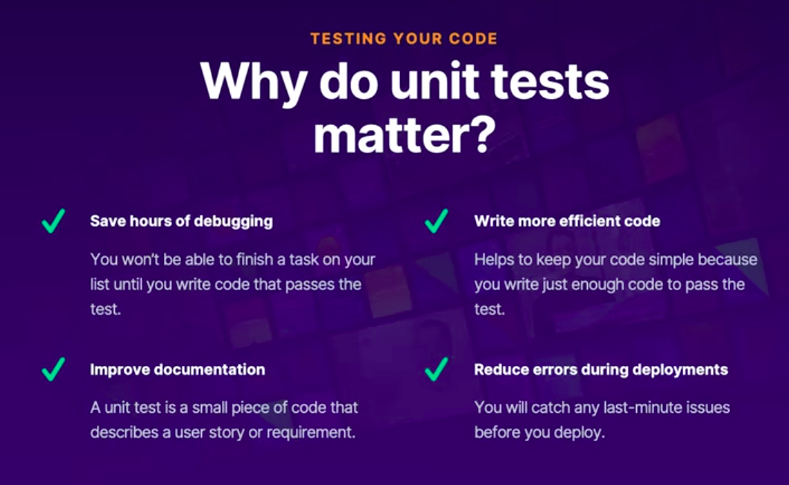

# Azure Resume Project: Unit Testing Documentation

Unit tests are a vital part of any CI/CD pipeline, validating code behavior and promptly identifying any regressions introduced by code changes. In this project, we utilize xUnit, a robust .NET unit testing framework, to test our Azure Functions.



## Understanding xUnit

xUnit is a free, open-source, community-focused unit testing tool for the .NET Framework. Renowned for its flexibility, robustness, and user-friendly nature, xUnit is a preferred choice among .NET developers.

## Implementing Unit Tests

Follow these steps to set up and execute unit tests for your Azure Functions:

1. **Create a Test Folder:** Within the `backend` directory of the Azure resume project, create a new folder named `tests`.

2. **Scaffold a New xUnit Project:** Navigate to the `tests` folder in your terminal and execute the following command to scaffold a new xUnit test project:

    ```bash
    dotnet new xunit
    ```

    This command generates a new xUnit test project, including all necessary files and configurations.

3. **Install Required Packages:** Execute the following command to add the `Microsoft.AspNetCore.Mvc` package to your test project:

    ```bash
    dotnet add package Microsoft.AspNetCore.Mvc
    ```

    This package is crucial for testing Azure Functions.

4. **Reference the Azure Functions Project:** Execute the following command to add a reference to the Azure Functions project in your test project:

    ```bash
    dotnet add reference ../api/api.csproj
    ```

    This command enables your test project to access the Azure Functions code and creates a test file named `UnitTest1.cs` in the `tests` folder.

5. **Execute the Tests:** Run the following command to execute your unit tests:

    ```bash
    dotnet test
    ```

    This command runs the test project, executing all unit tests. The output displays the test results, including any failures or errors.

6. **Write Your Unit Tests:** In the `backend/tests` directory in the [cgc-azure-resume-starter](https://github.com/ACloudGuru-Resources/acg-project-azure-resume-starter) repository, you'll find a couple of sample unit tests. You can modify these tests or add new ones to suit your requirements.

    The primary test file we use to test the Azure Function is `TestCounter.cs`. This file contains a sample test that checks the response from the Azure Function.

    ```csharp
    [Fact]
    public async void Http_trigger_should_return_known_string()
        {
            var counter = new Company.Function.Counter();
            counter.Id = "1";
            counter.Count = 2;
            var request = TestFactory.CreateHttpRequest();
            var response = (HttpResponseMessage) Company.Function.ResumeVisitCounter.Run(request, counter, out counter, logger);
            Assert.Equal(3, counter.Count);
        }
    ```

    This test creates a new `Counter` object, sets its properties, creates an HTTP request, and calls the `Run` method of the `ResumeVisitCounter` function. It then asserts that the counter value has been incremented correctly. This test passes if the counter value is incremented by one. If the test fails, it indicates that the Azure Function is not functioning as expected.

Remember, unit tests are your first line of defense against bugs and regressions. Regularly update and run your tests to ensure your code is functioning as expected.
